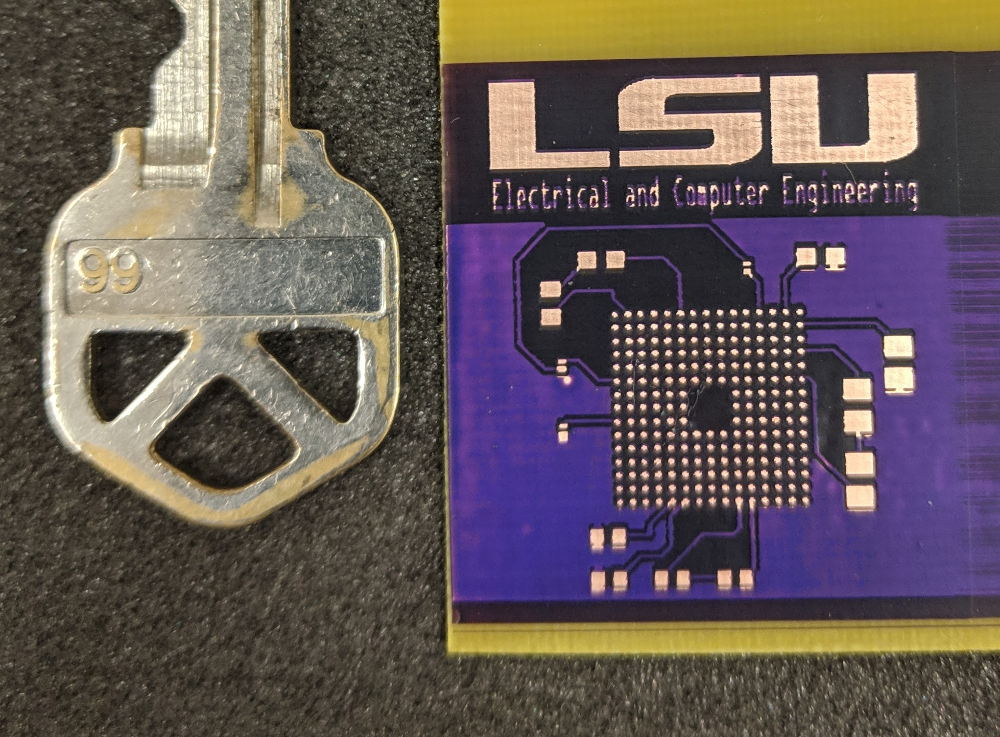
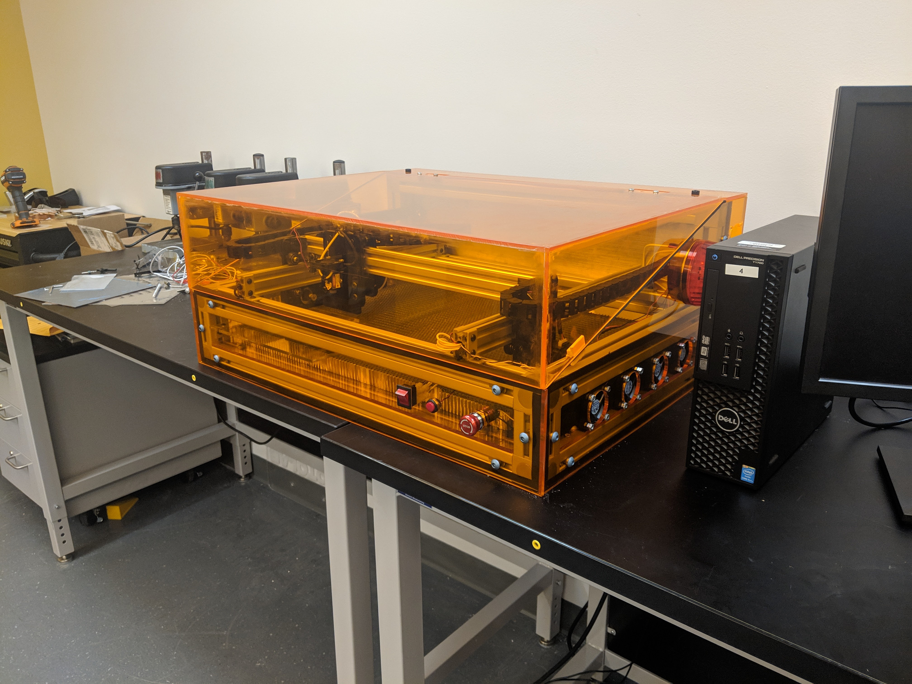

# LSU PCB Laser System

## This is a Senior Design project for the LSU-Department of Electrical & Computer Engineering The project has spanned two school years from 2018-2020

### Building the Project

Requires Qt Creator version 4.xx or above to build and is compatible on macOS, Linux, and Windows

#### Sample Board from Machine

#### Picture of Machine
